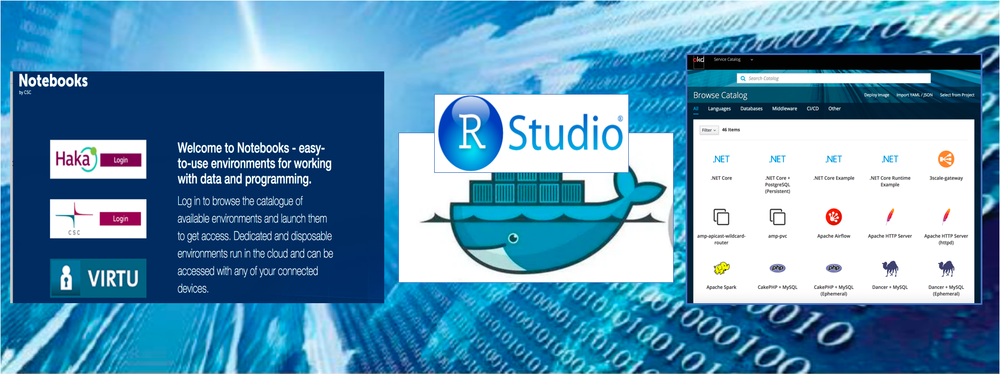

# Rstudio-daki tools

RStudio-daki tools are customised instances of rstudio, which is an integrated development environment (IDE) for R programming language, for analytics actvities of DAKI project. This repository helps us build a custom Rstudio as a containerised application which can be deployed in CSC's [Rahti container cloud](https://rahti.csc.fi/) and can eventually be accessed *via.* [notebooks environment](https://notebooks.csc.fi/). In the process of containerisation and deployment of these tools, this repository made use of openshift templates developed in one of other [CSC Github repositories](https://github.com/CSCfi/rstudio-openshift). Here, Rstudio images are built in docker environment. 

# Contents
- [Rstudio for basic learning environment](#Rstudio-for-basic-learning-environment) 
- [Rstudio for DAKI-specific use](#Rstudio-for-DAKI-specific-use)
- [Acessing rstudio application in CSC's notebooks environment](#Acessing-rstudio-application-in-CSC-notebooks-environment)
- [Useful CSC resources](#useful-CSC-resources)
- [Funding](#Funding)

# Rstudio for basic learning environment 
Rstudio dockerfile (file name: Dockerfile) for basic data analysis course (rstudio-shiny) includes the latest version of rstudio, R (v4.0.2) and basic R-packages. Other dockerfile (file name: *rstudio-rda.dockerfile*) for building  custom image (e.g., compatible in cPouta cloud) is also available in *rstudio-shiny* folder.

### Deploying Rstudio on Rahti *via* commandline
Please use  *rstudio-shiny-template.yaml* template which will use *Dockerfile* available in *rstudio-shiny* folder to deploy it on Rahti container cloud in your namespace (= your project). The following openshift command can be used for the deployment of  rstudio-shiny:

* *oc process -f rstudio-shiny-template.yaml -p NAME="application-name" -p USERNAME="your-username" -p PASSWORD="your-password" | oc apply -f -*

### Contents of basic RStudio

This basic RStudio docker container was built from the rocker base image:
```
rocker/r-ver:4.0.2
```

This rstudio comes with shiny server and the number of pre-installed packages as listed below:

```
tidyverse
corrplot 
RColorBrewer 
openxlsx 
readxl 
gridExtra 
ggfortify 
data.table 
dbplyr 
RSQLite 
BiocManager 
```

# Rstudio for DAKI-specific use

Rstudio docker container for DAKI project (rstudio-daki) includes the latest version of R (v4.0.0), rstudio and required R-packages to help with various data analysis activities in the broad scope of DAKI project. Customised Dockerfile (file name: Dockerfile) which is meant for deploying on Rahti and eventually on notebooks environment is available in *daki-shiny* folder. 

In addition to opehshift Dockerfile mentioned above, other "*rstudio-daki.dockerfile*" is also included to generate a docker image that can be deployed on cPouta environment where users usually have previlized access rights. The image thus generated however may not be compatible either in openshift or notebooks enviroment.

### Deployment of rstudio-daki on Rahti *via* commandline
Please use *rstudio-daki-shiny-template.yaml* file to deploy rstudio-daki on Rahti container cloud as shown below:

* *oc process -f rstudio-daki-shiny-template.yaml -p NAME="application-name" -p USERNAME="your-username" -p PASSWORD="your-password" | oc apply -f -*

### Contents of RStudio-daki

RStudio-daki is customised towards data analysis needs of DAKI project. Base image was built from rocker latest image:
```
rocker/r-ver:4.0.0
```

This container also comes with shiny server and the [large number of pre-installed packages](https://github.com/CSCfi/rstudio-daki/blob/master/rstudio-daki-shiny/install_daki.sh) including the following rstudio package managers:
```
BiocManager 
devtools 
remotes
```
In order to facilitate data analytics activties on public data sets, rstudio-daki has beeen installed with many [openscience datasets and scripts](https://github.com/CSCfi/Open-data-examples) including some of potentially useful open science datasets and mining tools as compiled by [rOpenGov](https://github.com/rOpenGov?page=1). These packages include:
```
vipunen
fmi2
hetu
statfi
digitransit
sorvi
rqog
helsinki
openthl
geofi
```
Special thanks to rOpenGov and people behind it for making analytics tools and datasets available in the form of R packages.

# Acessing rstudio application in CSC notebooks environment

First, navigate to [CSC Notebooks](https://notebooks.csc.fi) service using your HAKA authentication. The landing page after logging in shows a dashboard with a list of Blueprints which are ready for launching. You can launch a blueprint with name,  "Rstudio environment for DAKI and teaching activities" from the list. This rstudio has all required R packages.

In case you want to use a custom openshift rstudio application via notebooks environment, follow the instructions below:

### Login to CSC Notebooks to set up a group

if you want a custom notebook for your openshift rstudio applications, please request CSC  for administrator rights (aka, [group ownership rights](http://cscfi.github.io/pebbles/group_owners_guide.html)) for using CSC Notebooks. Once you have admin rights in place, you can see **Groups** and **Blueprints** in the menu on the top of the page. You can click on the **Groups** tab and then on  **Create a New Group** tab to create a group for your notebook.

### Create a new Blueprint for your rstudio application

You can request CSC notebooks admins to create a template (e.g., *Rahti RStudio*) to deploy your rahti rstudio. Once template is available, click **Create Blueprint** for rstudio custom notebooks. In that template, select the group created in the *Select Group* menu. Add name and description for your Blueprint. In order to fill **Openshift template URL** field, please use image-ready openshift templates (*-imageready.yaml file) available in this GitHub repository. Please note that you have to change URLs for your custom images in image-ready openshift template before creating **Blueprints** for notebooks.

<!---
 
--->

# Useful CSC resources
- [Apply for a new CSC project](https://my.csc.fi/)
- [Rahti container cloud](https://rahti.csc.fi/) 
- [Notebooks environment](https://notebooks.csc.fi/)
- [Rahti Docker registry](https://registry-console.rahti.csc.fi/)
- [Request a new course on CSC notebooks](https://www.webropolsurveys.com/S/84118B6BD6E97501.par) 

# Funding


