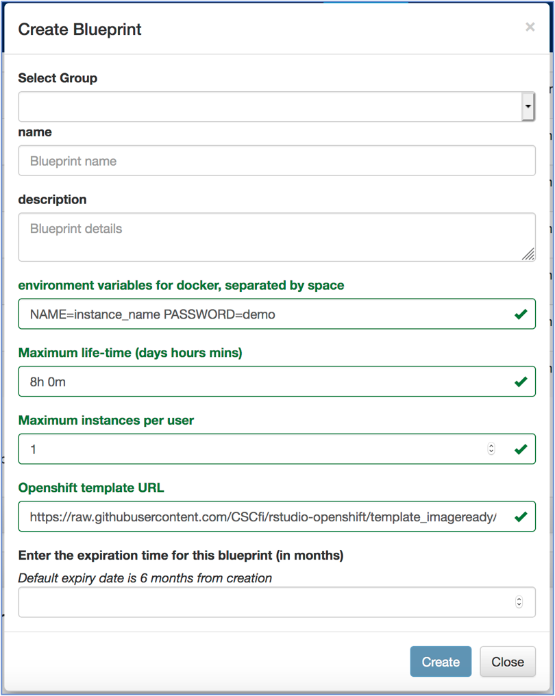

# Rstudio-daki tools 

Rstudio-daki repository facilitates building of containerised Rstudio application with  DAKI tools as well as the deployment of the application in CSC's [Rahti container cloud](https://rahti.csc.fi/) and [notebooks environment](https://notebooks.csc.fi/). In the process of containerisation and deployment, this repository extends openshift templates developed in one of other [CSC Github repositories](https://github.com/CSCfi/rstudio-openshift) to build customised Rstudio applications. Custom Rstudio images are built here in docker environment and can be tailored for similar needs. 

Current efforts towards these custom images include:
- [Rstudio for basic learning environment](#Rstudio-for-basic-learning-environment) 
- [Rstudio for DAKI project](#Rstudio-for-DAKI-project)

Once rstudio image is compatible for deploying in openshift environment, you can then use it to deploy in notebooks environment at CSC. One way to check whether your custom image is compatible with openshift environment is to actually deploy the image successfully in Rahti container cloud at CSC. Please follow the instructions for [deploying a pre-made rstudio image onto notebooks environment](#Deployment-of-Rstudio-image-onto-notebooks-environment)

# Rstudio for basic learning environment 
Rstudio dockerfile (file name: Dockerfile) for basic data analysis course (rstudio-shiny) includes the latest version of rstudio, R (v4.0.2) and basic R-packages. Other dockerfile (file name: *rstudio-rda.dockerfile*) for building  custom image (e.g., in cPouta cloud) is also available in *rstudio-shiny* folder.

## Deploying Rstudio on Rahti *via* commandline
Please use  *rstudio-shiny-template.yaml* template which will use *Dockerfile* available in *rstudio-shiny* folder to deploy it on Rahti.

The following openshift command can be used to deploy rstudio-shiny server on Rahti:

* *oc process -f rstudio-shiny-template.yaml -p NAME="application-name" -p USERNAME="your-username" -p PASSWORD="your-password" | oc apply -f -*

# Rstudio for DAKI project

Rstudio docker container for DAKI project (rstudio-daki) includes the latest version of R (v4.0.0), rstudio and required R-packages to help with various data analysis activities in the broad scope of DAKI project. Customised Dockerfile (file name: Dockerfile) which is meant for deploying on Rahti and eventually on notebooks environment is available in *daki-shiny* folder. 

In addition to opehshift Dockerfile mentioned above, other "*rstudio-daki.dockerfile*" is also included to generate a docker image that can be deployed on cPouta environment where users usually have previlized access rights. The image thus generated however may not be compatible either in openshift or notebooks enviroment.

### Deployment of rstudio-daki on Rahti *via* commandline
Please use *rstudio-daki-shiny-template.yaml* file to deploy rstudio-daki on Rahti container cloud as shown below:

* *oc process -f rstudio-daki-shiny-template.yaml -p NAME="application-name" -p USERNAME="your-username" -p PASSWORD="your-password" | oc apply -f -*

# Deployment of Rstudio image onto notebooks environment

### Login to CSC Notebooks to set up a group

First, navigate to [CSC Notebooks](https://notebooks.csc.fi) service using your HAKA authentication. The landing page after logging in shows a dashboard with a list of Blueprints which are ready for launching a notebook of your choice. However, if you do want a custom notebook for your rstudio, please request CSC  for
administrator rights (aka, [group ownership rights](http://cscfi.github.io/pebbles/group_owners_guide.html)) for using CSC Notebooks. Once you have admin rights in place, you can see **Groups** and **Blueprints** in the menu on the top of the page. You can click on the **Groups** tab and then on  **Create a New Group** tab to create a group for your notebook.

### Create a new Blueprint for your rstudio application

Click on the **Blueprints** tab in the top menu to access various *Templates* for creating a Blueprint. Choose a template with name *Rahti RStudio* and click **Create Blueprint** for rstudio custom notebooks. The template is shown in picture below for clarity. Select the group created in the *Select Group* menu. Add name and description for your Blueprint. In order to fill **Openshift template URL** field, please use image-ready openshift templates (*-imageready.yaml file) available in this GitHub repository. Please note that you have to change URLs for your custom images in image-ready openshift template before creating **Blueprints** for notebooks.

# Useful CSC resources
- [Apply for a new CSC project](https://my.csc.fi/)
- [Rahti container cloud](https://rahti.csc.fi/) 
- [Notebooks environment](https://notebooks.csc.fi/)
- [Rahti Docker registry](https://registry-console.rahti.csc.fi/)
- [Request a new course on CSC notebooks](https://www.webropolsurveys.com/S/84118B6BD6E97501.par) 

# Funding

